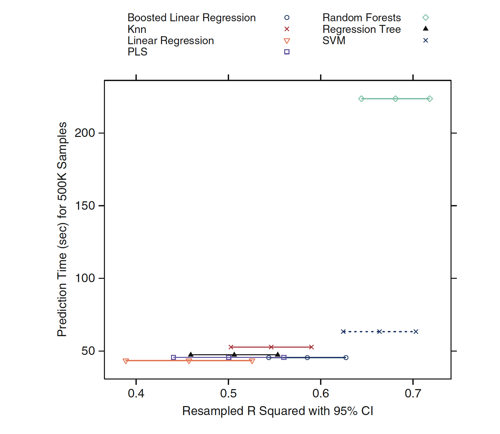

```{r setup, include=FALSE}
knitr::opts_chunk$set(echo=FALSE)
```


```{r installing necessary packages, include=FALSE}
# installing the packages
installNewPackage <- function(packageName) {
        if(packageName  %in% rownames(installed.packages()) == FALSE)
        {
                install.packages(packageName, repos = "http://cran.us.r-project.org", dependencies=TRUE)
        }
}

installNewPackage("ggplot2")
installNewPackage("scales")
installNewPackage("caret")
installNewPackage("AppliedPredictiveModeling")
installNewPackage("Hmisc")

library(ggplot2)
library(scales)
library(caret)
library(AppliedPredictiveModeling)
library(Hmisc)
```


## Question 1 

For this question we are considering the Music Genre data set. So first up we need to get the dataset. I have used a base function in R to get it here. Lets see the first 6 rows/classes in that dataset using head().

```{r Question1}
# Reading the data
genres <- read.table("data/genresBaseline.txt", header = FALSE, col.names = c("class"))

# Viewing the top 6 Rows
head(genres)
```

Thus we see that we have the classes needed for us. Lets just answer the questions.

### Section (a)

When ever spliting up data, the two things to consider are 

- Number of samples and predictors in the dataset
- Distribution of the class labels

The dataset looks big in number with 12495 samples. Lets look at the class label distribution. The best way to do that will be using visualization ie) a bar chart of the classes.

```{r Question1(a)}
# Making a barplot of the genre classes
ggplot(genres, aes(x = as.factor(class))) +
    geom_bar(aes(y = (..count..)/sum(..count..))) +
    geom_text(aes(y = ((..count..)/sum(..count..)), label = scales::percent((..count..)/sum(..count..))), stat = "count", vjust = -0.25) +
    scale_y_continuous(labels = percent) +
    labs(title = "Genre class label distribution", y = "Percent", x = "Genre Classes") +
    theme(plot.title = element_text(hjust = 0.6))
```

The above plot shows the distribution of the genres. We can clearly see that there is imbalance distribution where the metal class being the lowest having only 2% of the total and classical being 30.5% of the total genres. To decide the data spliting method, we need to consider the number of samples.The number of samples in the dataset (12495) is larger than the number of predictors(191) that we can split it into train and test set. Also the number of samples is large enough that doing a resampling or crossvalidation.

Considering the imbalance in the distribution and the number of samples in the dataset, we can split this dataset into train and test set and use strartified random sampling for this method. 

## Section (b)

The code used to implement the section a is below 

cv_index <- createDataPartition(genres$class, p = .8, list = FALSE)

cv_index has the index for the test adn train set.

```{r Question1(b)}
# Set the seed
set.seed(1)

# Splitting the data
cv_index <- createDataPartition(genres$class, p = .8, list = FALSE)

# Details 
# head(cv_index)
# nrow(cv_index)

# To view the full index (*** Uncomment the code below ***)
# cv_index
```


## Question 2 

Lets just load the Permeablity dataset for answering this question.

```{r Question2}
# Reading the data
data("permeability")
permeability_df <- as.data.frame(permeability)

# Viewing the top 6 Rows
head(permeability_df)
```

Thus we have our data loaded.

## Section (a)

Similar to question 1, we have to first see the below points for selecting our splitting method for this dataset

- Number of samples and predictors in the dataset
- Distribution of the class labels

Let load the dataset and see the distribution of the Permeablity which is continuous value by using a histogram.

```{r Question2(a)}
# Making a histogram of the Permeablity
hist(permeability_df$permeability, col = "grey", xlab = "Permeablity", ylab = "Frequency", main = "Histogram of Permeablity")
```

Above we have the frequency distribution of Permeablity visualized in a histogram. The book says that this dataset has total number of 165 samples but there are almost 1107 predictors. Thus number of samples is less than the number of predictors, we cannot split the data into training and testing set here as the number of samples is much smaller than the number of predictors. Also the distribution of Permeablity is skewed in this dataset.

Thus inorder to make the data distribution proper, I am using strartification and since the number of samples is small I am using cross validation as my resampling method. 

### Section (b)

Let us use the createMultiFolds() in caret package to perform strartified cross validation resampling with 10 folds.

strartified_index <- createMultiFolds(permeability, k = 10, times = 25)

```{r Question2(b)}
# Creating the Startified sample index
strartified_index <- createMultiFolds(permeability, k = 10, times = 25)
par(mfrow = c(2,2))
for(i in 1:4){
    hist(permeability[strartified_index[[i]]], main = paste0("Permeability of ", i, "th fold"), col = "grey",
         xlab = "Permeability")
}
for(i in 5:8){
    hist(permeability[strartified_index[[i]]], main = paste0("Permeability of ", i, "th fold"), col = "grey", 
         xlab = "Permeability")
}
for(i in 9:10){
    hist(permeability[strartified_index[[i]]], main = paste0("Permeability of ", i, "th fold"), col = "grey", 
         xlab = "Permeability")
}
```

Thus from the above plots we can clearly see that each folds of data created, retains the label distributions of the original data.

## Question 3 

First of all, let us load the data for the processing and view the first six samples with some of the predictor columns in the dataset.

```{r Question3}
# Loading the data
data("ChemicalManufacturingProcess")
chem_df <- ChemicalManufacturingProcess
head(chem_df[, 1:5])
```

Thus we have the data loaded successfully. We have to load the resampled R^2 value informations which is given in the question. Lets do that and see those information.

```{r Question3ii}
# Load the R^2 information
components <- 1:10
means <- c( 0.444, 0.500, 0.533, 0.545, 0.542, 0.537, 0.534, 0.534, 0.520, 0.507 )
std_errors <- c( 0.0272, 0.0298, 0.0302, 0.0308, 0.0322, 0.0327, 0.0333, 0.0330, 0.0326, 0.0324 )
rsquare_df <- data.frame( components, means, std_errors ) 

# View the data frames
rsquare_df
```

And thus we have the loaded the information successfully.

### Section (a)

For this question, we are going to use "one-standard-error" method to find out the number of PLS components provides the most parsimonious model. One standard error method is one which selects the simplest model with accuracy no less than the difference between the highest mean value and a standard error from the mean is selected. 

```{r Question3(a)}
# Make the error bars
errbar(components, means, means + std_errors, means - std_errors, xlab = "Components", ylab = "Means")  
grid()
# Get the max means inde
max_index <- which.max(means)
# Draw the abline at the max lower bound
abline(h = means[max_index] - std_errors[max_index], col = 'red')
```

The above plot shows the error bars in accordance to the number of components and mean R^2 value. The red horizantal line shows that the overall best mean value which cuts exactly at 4th components with a lower bound of 0.51. Thus, according to the one standard error method <strong>3 PLS components</strong> would provide the most parsimonious model where its value no less than one standard error from the mean.

### Section (b)

Now let us decide the number of PLS components using the tolerance value. In order to do that we need to compute the tolerance value first for all the componets.

```{r Question3(b), include=FALSE}
# Compute the tolarence
rsquare_df["tolarence"] = (rsquare_df["means"] - means[max_index]) / means[max_index] * 100

# View the data
rsquare_df
```

Thus above table shows the tolarence value for each components. Let us plot the tolarence for each components and decide how many components would be the best to choose.

```{r Questionb(b)ii}
plot(rsquare_df$components, rsquare_df$tolarence, col = "blue", xlab = "Components", ylab = "Tolarence")
abline(h = -10, col = "red")
```

In the above plot, we can see the 10 % tolarence is shown by the red line.Thus <strong> 2 PLS components</strong> with a tolarence value of ~8.25 % and mean 0.5 would be the optimal number of PLS componets from this whole bunch of information.

### Section (c)

First let us look at the Resampled R-squared values with 95% confidence inteval for different models in the below plots.



From the above figure, the model with the best R^2 value is Random Forest. But SVM has nearly equivalent results and overlap of the confidence interval of their R^2 value. Next on the scale is Boosted Linear Regression but this would be significantly worsed in R^2 value drop. Thus based on R^2 value, Random Forest or SVM would be the best to go for. When looking at the execution time while making the prediction SVM wins the Random Forest method by a big margin. Thus SVM will be the good choice. 

### Section (d)

However, if the prediction of the new data needs to be faster than the SVM when we are considering the prediction time, we need to recode the prediction function in order to use it. In that case neither SVM nor Random Forest would be preferred. Thue, the <strong>Regression Tree or PLS model</strong> would better choice eventhough we have the substantial R^2 drop.


## Question 4

Let us load the data first from the caret package and view them to verify whether we have loaded the dataset.

```{r Question4}
# Load the data
data("oil")

# Explore the oil type
print(str(oilType))

# Distribution in Counts
print(table(oilType))
```

Thus we can see that we have loaded the data successfully. Now that we have seen the frequency distribution of the categorical oil type, let us also view the percentage distributions of the oil type.

#### Original Data in percentage distribution

```{r Question4ii}
# Distribution in Percentage
distributions <- round((table(oilType) / length(oilType)) * 100, 2)
print(distributions)
```

Thus we have oil type percentage distributions.

### Section (a)

Let us the use the sample() to completely make random sample of 60 oils out of the oil type variable for over 10 splits.

```{r Question4(a)}
# Set the seed
set.seed(1)

# Initailize the vector
split_index <- vector(mode = "list", length = 10)

# Loop through the splits
for(i in seq(along = split_index)) {
    split_index[[i]] <- table(sample(oilType, size = 60))
}

# Combine the list into dataframe
split_index <- rbind.data.frame(split_index)
colnames(split_index) <-1:10
split_index <- as.data.frame(t(split_index))

# View the splits
split_index
```

From the above table, we can see that the freqeuncy of the random sample almost matches with the frequency of the original sample. We can see that by comparing the percentage distribution in much better way.

#### Percentage distribution using random sample

```{r Question4(a)ii}
round((colSums(split_index) / 600) * 100, 2)
```

Comparing this with the oiltype percentage distribution before, we can understand that the random samples matches the frequency of original sample.

### Section (b)

Now we are going to create a stratified random sample using createDataPartition() in caret package.

```{r Question4(b)}
# Set the seed
set.seed(1)

# Call the function
split_index_st <- createDataPartition(oilType, p = 0.6, times = 10)

# Apply over the each sample list index
split_index_st <- lapply(split_index_st, function(x, y) table(y[x]), y = oilType)

# Combine the list into dataframe
split_index_st <- rbind.data.frame(split_index_st)
colnames(split_index_st) <-1:10
split_index_st <- as.data.frame(t(split_index_st))

# View the splits
split_index_st
```

From the above table, we can see that the freqeuncy of the stratified sample almost matches with the frequency of the random sample. We can see that by comparing the percentage distribution in much better way.

#### Percentage distribution using Startified sample

```{r Question4(b)ii}
# Percentage distribution
round((colSums(split_index_st) / 600) * 100, 2)
```

The above result shows that the stratfied samples created using createDataPartition has much less variablity than the random sample method in comparison with the original distribution. And each sample has atleast one sample in each class.

### Section (c)

Although there are different ways to determine the performance of the model, we can use Leave one out cross validation as it can represent each classes in all the samples while testing our models. So as for as a test set to concern, using Leave one out cross validation may be resonsable. Using a random split of train and test set might produce the test set with the most samples class of oiltype such as A, B and may be E and F. This would only protect the overfitting of the model but not be increasing the performance of the model as the classes such as C, D and G are not taken into consideration.

### Section (d)

Let us create a correct samples ranging from 10 to 30 for a test set of 30 samples. Using Binomial test on each of the acccuracy values we will find the confidence interval and use that to study about the uncertainity in the results.

```{r Question4(d)}
# Initialize the variables
num_correct = 10:30
width_of_interval = c()

# Loop through the number of correct elements
# to compute the confidence interval
for(nc in num_correct) {
  bt_out = binom.test(nc, 30)
  width_of_interval = c(width_of_interval, diff(bt_out$conf.int)) 
}

# Plot the Confidence interval over the number correct
plot(num_correct, width_of_interval * 100, type = "l", main = "Confidence Interval vs Accuracy", lwd = 2,
     xlab = "Number of correct samples (from 30)", ylab = "Width of 95% confidence interval")
```

With the test set size of 30 and number of correct samples on testing ranging from 10 to 30, we have the confidence interval plotted on the y-axis. From the plot we can infer that the confidence increase from 10 to 15 samples and then decreases and reaches 11.6% at 30. The biggest confidence interval of 37.4% occurs at 15 correct samples.

We can understand that the model would have better model performance on the testing time if the confidence interval is small because of the less chance of uncertainity in the results.

*** End of Solution ***

### Appendix - Coding

\# installing the packages
installNewPackage <- function(packageName) {

        if(packageName  %in% rownames(installed.packages()) == FALSE)

        {

                install.packages(packageName, repos = "http://cran.us.r-project.org", dependencies=TRUE)

        }

}


installNewPackage("ggplot2")

installNewPackage("scales")

installNewPackage("caret")

installNewPackage("AppliedPredictiveModeling")

installNewPackage("Hmisc")


library(ggplot2)

library(scales)

library(caret)

library(AppliedPredictiveModeling)

library(Hmisc)

## Question 1

\# Reading the data

genres <- read.table("data/genresBaseline.txt", header = FALSE, col.names = c("class"))

\# Viewing the top 6 Rows

head(genres)


### Section (a)

\# Making a barplot of the genre classes

ggplot(genres, aes(x = as.factor(class))) +

    geom_bar(aes(y = (..count..)/sum(..count..))) +

    geom_text(aes(y = ((..count..)/sum(..count..)), label = scales::percent((..count..)/sum(..count..))), stat = "count", vjust = -0.25) +

    scale_y_continuous(labels = percent) +

    labs(title = "Genre class label distribution", y = "Percent", x = "Genre Classes") +

    theme(plot.title = element_text(hjust = 0.6))


### Section (b)

\# Set the seed

set.seed(1)

\# Splitting the data

cv_index <- createDataPartition(genres$class, p = .8, list = FALSE)

\# Details 

head(cv_index)

nrow(cv_index)


## Question 2

\# Reading the data

data("permeability")

permeability_df <- as.data.frame(permeability)

\# Viewing the top 6 Rows

head(permeability_df)


### Section (a)

\# Making a histogram of the Permeablity

hist(permeability_df$permeability, col = "grey", xlab = "Permeablity", ylab = "Frequency", main = "Histogram of Permeablity")


### Section (b)

\# Creating the Startified sample index

strartified_index <- createMultiFolds(permeability, k = 10, times = 25)

par(mfrow = c(2,2))

for(i in 1:4){

    hist(permeability[strartified_index[[i]]], main = paste0("Permeability of ", i, "th fold"), col = "grey",

         xlab = "Permeability")

}

for(i in 5:8){

    hist(permeability[strartified_index[[i]]], main = paste0("Permeability of ", i, "th fold"), col = "grey", 

         xlab = "Permeability")

}

for(i in 9:10){

    hist(permeability[strartified_index[[i]]], main = paste0("Permeability of ", i, "th fold"), col = "grey", 

         xlab = "Permeability")

}


## Question 3

\# Loading the data

data("ChemicalManufacturingProcess")

chem_df <- ChemicalManufacturingProcess

head(chem_df[, 1:5])


### Section (a)

\# Make the error bars

errbar(components, means, means + std_errors, means - std_errors)  

grid()

\# Get the max means inde

max_index <- which.max(means)

\# Draw the abline at the max lower bound

abline(h = means[max_index] - std_errors[max_index], col = 'red')


### Section (b)

\# Compute the tolarence

rsquare_df["tolarence"] = (rsquare_df["means"] - means[max_index]) / means[max_index] * 100

\# View the data

rsquare_df


### Section (c)

No code for this

### Section (d)

No code for this


## Question 4

### Section (a)

\# Load the data

data("oil")

\# Explore the oil type

print(str(oilType))

\# Distribution in Counts

print(table(oilType))


### Section (b)

\# Set the seed

set.seed(1)

\# Initailize the vector

split_index <- vector(mode = "list", length = 10)

\# Loop through the splits

for(i in seq(along = split_index)) {
    
    split_index[[i]] <- table(sample(oilType, size = 60))
    
}

\# Combine the list into dataframe

split_index <- rbind.data.frame(split_index)

colnames(split_index) <-1:10

split_index <- as.data.frame(t(split_index))

\# View the splits

split_index


### Section (c)

\# Percentage distribution

round((colSums(split_index_st) / 600) * 100, 2)


### Section (d)

\# Initialize the variables

num_correct = 10:30

width_of_interval = c()

\# Loop through the number of correct elements

\# to compute the confidence interval

for(nc in num_correct) {

  bt_out = binom.test(nc, 30)

  width_of_interval = c(width_of_interval, diff(bt_out$conf.int)) 

}

\# Plot the Confidence interval over the number correct

plot(num_correct, width_of_interval * 100, type = "l", main = "Confidence Interval vs Accuracy", lwd = 2,

     xlab = "Number of correct samples (from 30)", ylab = "Width of 95% confidence interval")


#### End of the Assignemnt